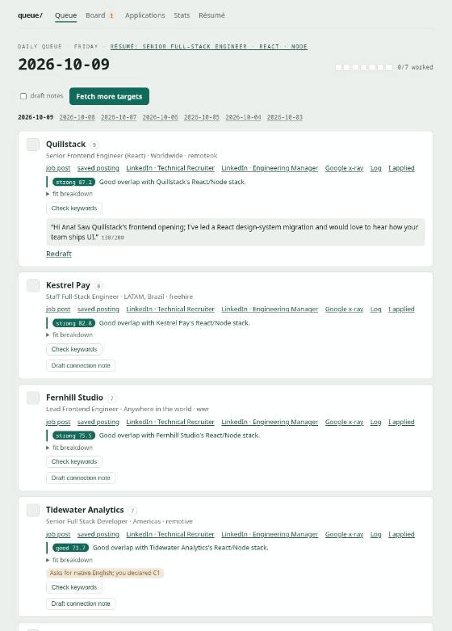

# simple-job-seeker

> **Work in progress** — under active development, expect rough edges and
> breaking changes.

Personal tooling for a remote job search: a Python pipeline that scores
jobs from remote boards into a daily queue with prebuilt LinkedIn search
links, plus a Chrome extension that scores whatever's on screen on the
LinkedIn feed or a Jobs page.

## Why

Automate the research, not the outreach. The click stays human — keeps the
account safe from bans. See `CLAUDE.md` for the exact rule.

## Demo

Mocked data, no real jobs, companies or people. The daily queue with a
card's résumé fit breakdown, ticking a card off and logging the
touchpoint, then the Board, Applications and the skill gaps on Stats:



Still: [the daily queue](docs/screenshots/daily-queue.png).

## Layout

- **`server/`** — Python pipeline: collection, scoring, SQLite state, web
  UI, outreach tracker. Stdlib only. See
  [`server/README.md`](server/README.md).
- **`extension/`** — Chrome extension (Manifest V3, no build step). Manual
  click reads the LinkedIn feed/Jobs page, POSTs to `server/`'s
  `/api/rate` for scoring; hits land in the same queue. Read-only against
  the page. See [`extension/README.md`](extension/README.md).

## Quick start

```sh
cd server
$EDITOR config.toml          # your roles, stack and languages (see Configuration)
./install.sh                 # optional: local Ollama + a GPU-fitted model
python3 queue_agent.py       # build today's queue
python3 -m webapp            # local web UI at http://127.0.0.1:3000
```

Both share the same `state.db`. Import your LinkedIn export on the web
UI's Résumé tab to turn on résumé-fit scoring. See
[`server/README.md`](server/README.md) for the full workflow (tracker,
cron, résumé matching) and
[Getting started](server/docs/getting-started.md) for a guided first run.

### With Docker

From the repo root:

```sh
docker compose up -d                                  # web UI at http://127.0.0.1:3000
docker compose run --rm web python3 queue_agent.py    # CLIs, same state
docker compose down
```

Compose mounts `server/` into the container, so `state.db`, `config.toml`,
`.env` and `queues/` stay on your machine, shared with the commands above.
After a code change, `docker compose restart` is enough; no rebuild. It
uses host networking (Linux), so the web UI still binds to `127.0.0.1` only
and reaches a local Ollama on `localhost:11434`. The container comes back
with Docker after a reboot until you run `docker compose down`.

It runs as uid/gid 1000. If yours differ (`id -u`, `id -g`), set `UID` and
`GID` in a `.env` at the repo root (gitignored), or files the container
writes won't be yours.

### With tmuxinator

From the repo root:

```sh
tmuxinator start           # attach to the job-seeker session
tmuxinator stop job-seeker # also runs docker compose down
```

Two windows: `web` runs `docker compose up` with the server log (Ctrl-C
stops the container, `d` detaches and leaves it running), and `shell` opens
at the repo root.

## Configuration

Everything lives in one file, **`server/config.toml`**, read fresh on every
run: edit it and the next build or page reload picks it up. It ships tuned
for a senior full-stack profile hiring from Brazil, so make it yours first:

1. **`[filters]`**: the roles (`role_keywords`, matched against the title)
   and stack (`stack_keywords`) you want, what to drop
   (`exclude_keywords`), and `brazil_friendly_only = false` if you're not
   hiring from Brazil.
2. **`[gates]`**: the languages you work in, with your level, plus the
   citizenship and region phrases that rule a posting out for you.
3. **`[sources]`**: the search terms sent to each job board.

| Section | What it controls |
| --- | --- |
| `[targets]` | Queue size, company cooldown, and which LinkedIn people searches each card gets (recruiters, EMs…) |
| `[sources]` | Job boards to pull from (RemoteOK, Remotive, We Work Remotely, HN "Who is hiring?", freehire.me) and their search terms |
| `[filters]` | Keyword scoring: a role keyword must match the title, stack keywords add points, exclude keywords reject; Brazil-friendly location filter |
| `[gates]` | Rejects postings you can't be hired for — required languages, citizenship or clearance, region-only — before any LLM call |
| `[resume]` / `[resume.weights]` | Résumé-fit re-rank: how many jobs the LLM judges, the score cut, your career goals, the weight of each fit dimension |
| `[keywords.aliases]` | Skill spellings to merge (`k8s` → `kubernetes`) for skill gaps and keyword checks |
| `[expiry]` | Limits for `queue_agent.py --recheck`, which marks taken-down postings expired |
| `[applications]` | When a tracked application is due a follow-up, or gets offered as `no_response` |
| `[web]` | Web UI bind address and port — keep `127.0.0.1` |
| `[llm]` / `[ollama]` / `[openai]` | LLM backend for notes, résumé fit and keyword checks: a local Ollama (default) or any OpenAI-compatible endpoint |
| `[extension]` | The token that turns on the Chrome extension's `/api/rate` endpoint |

Every key, with defaults: [Configuration](server/docs/configuration.md).

API keys never go in `config.toml` (it's committed). Put them in
**`server/.env`** (gitignored), e.g. `NVIDIA_API_KEY="nvapi-..."` when
`[llm].provider = "openai"`. The `.env` at the repo root is only for
Docker's `UID`/`GID`.

## Browser extension

`extension/` scores whatever's on screen on the LinkedIn feed or a Jobs
page, on your click — nothing runs in the background, nothing is clicked
for you. Anything that clears the bar lands in today's queue.

1. In `server/config.toml`, set `[extension].token` to any random string.
2. `chrome://extensions` → **Developer mode** → **Load unpacked** → pick
   `extension/`.
3. With the web UI running, open the extension popup and paste the same
   token.

Usage and fixing empty scans: [`extension/README.md`](extension/README.md).

## Documentation

| Doc | What's in it |
| --- | --- |
| [`server/README.md`](server/README.md) | Pipeline, daily routine, tracker, applications, cron |
| [Getting started](server/docs/getting-started.md) | Requirements, setup, your first queue |
| [Concepts](server/docs/concepts.md) | The mental model: queue, targets, the checkbox, the pipeline |
| [Web UI guide](server/docs/web-ui.md) | Every page, button and workflow |
| [CLI reference](server/docs/cli-reference.md) | `queue_agent.py`, `tracker.py`, `profile`, `install.sh` |
| [Résumé matching](server/docs/resume-matching.md) | Import your résumé, re-rank, personalize notes |
| [Configuration](server/docs/configuration.md) | Every setting in `config.toml` |
| [Architecture](server/docs/architecture.md) | Components, data model, sources, privacy design |
| [`extension/README.md`](extension/README.md) | Chrome extension setup and use |

## Inspiration and alternatives

- **[ai-job-search](https://github.com/MadsLorentzen/ai-job-search)** by
  Mads Lorentzen: a Claude Code–driven job application system. Several
  planned features here are ported from it (see
  [`server/.specs/ai-job-search-ports/SPEC.md`](server/.specs/ai-job-search-ports/SPEC.md)).
  - Pick it if you want tailored CV and cover letter PDFs, a full
    application tracker from draft to offer, and you already use Claude
    Code.
  - Pick simple-job-seeker if you want a daily outreach queue, a local or
    free model, no dependencies, and nothing that touches LinkedIn
    programmatically.
