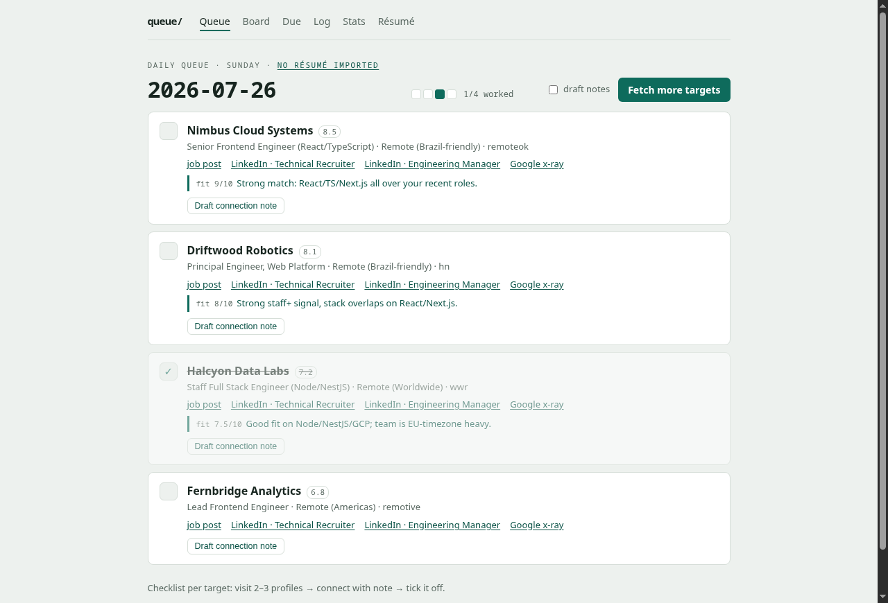

# simple-job-seeker

> **Work in progress** — under active development, expect rough edges and
> breaking changes.

Personal tooling for a remote job search: a Python pipeline that scores
jobs from remote boards into a daily queue with prebuilt LinkedIn search
links, plus a Chrome extension that scores whatever's on screen on the
LinkedIn feed or a Jobs page.

## Why

Automate the research, not the outreach. The click stays human — keeps the
account safe from bans. See `CLAUDE.md` for the exact rule.

## Screenshot

The daily queue (mocked data, no real jobs/companies):



## Layout

- **`server/`** — Python pipeline: collection, scoring, SQLite state, web
  UI, outreach tracker. Stdlib only. See
  [`server/README.md`](server/README.md).
- **`extension/`** — Chrome extension (Manifest V3, no build step). Manual
  click reads the LinkedIn feed/Jobs page, POSTs to `server/`'s
  `/api/rate` for scoring; hits land in the same queue. Read-only against
  the page. See [`extension/README.md`](extension/README.md).

## Quick start

```sh
cd server
python3 queue_agent.py       # build today's queue
python3 -m webapp            # local web UI at http://127.0.0.1:3000
```

Both share the same `state.db`. See `server/README.md` for the full
workflow (tracker, cron, résumé matching, config).
