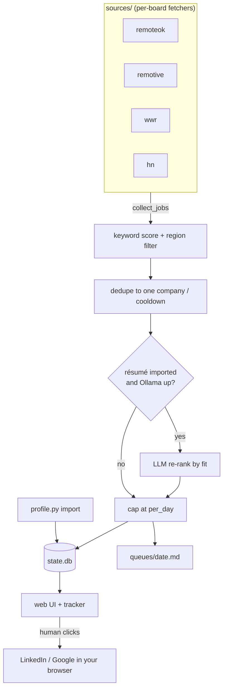

# Architecture

[← Docs home](README.md)

A deliberately small system: a few single-purpose Python files, one SQLite
database, and one config file. No framework, no third-party packages.

## Design constraints

- **Pure standard library.** No dependencies to install or keep secure. The
  only external moving part is an optional local Ollama server.
- **Python 3.11+** (uses `tomllib`).
- **Everything local.** Personal data never leaves your machine.
- **Surgical over sweeping.** Changes are kept small and targeted.

## Components

| File / dir | Responsibility |
| --- | --- |
| `queue_agent.py` | The pipeline: score, filter, dedupe, rank, persist, render. Owns `state.db`'s schema. |
| `sources/` | One module per job board behind a facade (see [below](#sources)). |
| `profile.py` | Résumé ingestion (CLI + reusable `ingest()`); writes the `profile` table. |
| `tracker.py` | Outreach CLI (add/due/done/board/history); writes the `outreach` table. |
| `webapp.py` | Local web UI over the same pipeline and DB (`http.server` + `sqlite3`). |
| `config.toml` | All configuration. Read fresh on every run. |
| `install.sh` | Optional: install/select a GPU-fitted Ollama model. |
| `state.db`, `queues/`, `cron.log` | Local, gitignored data. |

## Data flow



The keyword gate and dedupe always run; the LLM re-rank is conditional and
fails soft. The final arrow is the important one: the tool stops at generating
links — **the human makes every LinkedIn action**.

## Sources

Job boards live in the `sources/` package, each a module exposing a uniform
`fetch(cfg) -> list[Job]`:

```
sources/
  base.py       # shared: the Job model, _get (HTTP), strip_html
  remoteok.py   # fetch(cfg)
  remotive.py   # fetch(cfg)
  wwr.py        # fetch(cfg)
  hn.py         # fetch(cfg)  — Hacker News "Who is hiring?"
  __init__.py   # facade: REGISTRY + collect_jobs()
```

`sources/__init__.py` is the **facade**: `REGISTRY` maps a name to its
`fetch`, and `collect_jobs(cfg)` drives every enabled source, turning a dead
board into a logged warning rather than a crash. `queue_agent.py` re-exports
`Job` and `collect_jobs`, so the rest of the code (and these docs) refer to
`qa.Job` / `qa.collect_jobs` unchanged.

**To add a board:** drop a module with a `fetch(cfg)` into `sources/`,
register it in `REGISTRY`, and add its name to `[sources] enabled`. Providers
import shared helpers from `sources/base.py` and never from `queue_agent`, so
the dependency graph stays acyclic.

## Data model (`state.db`)

One SQLite file, shared by all four tools. Every table is created on first
use, so any tool can run first.

| Table | Holds |
| --- | --- |
| `seen_jobs` | Every job uid ever seen, to avoid re-queuing. |
| `queued_companies` | Per company: when last queued and how many times (drives the cooldown). |
| `queue_items` | The persisted daily queues — one row per (date, target) — including score, drafted note, done flag, description, and the LLM fit note/score. |
| `profile` | The single imported résumé row: compact text, headline, skills, import date. |
| `outreach` | The touchpoint log: company, person, action, note, date, follow-up date + done flag. |

Schema changes to `queue_items` use guarded `ALTER TABLE` migrations, so an
existing database upgrades in place without losing history.

## Privacy by design

This is the load-bearing principle, enforced in the architecture:

- **Nothing touches LinkedIn programmatically.** No source fetches, scrapes,
  or automates LinkedIn. The résumé is a manual export *you* download and feed
  in from local disk. Every source is a public API or RSS feed. The tool only
  ever emits links for you to click.
- **Local-only surface.** `webapp.py` binds to `127.0.0.1`; its forms reject
  cross-origin POSTs. The database is never exposed.
- **Data about real people stays out of git.** `state.db`, `queues/`,
  `cron.log`, and any `*.zip` export are gitignored.

If a change would have code touch LinkedIn or expose `state.db`, that change is
wrong by definition — not a trade-off to weigh.

---

Back to the [docs home](README.md).
